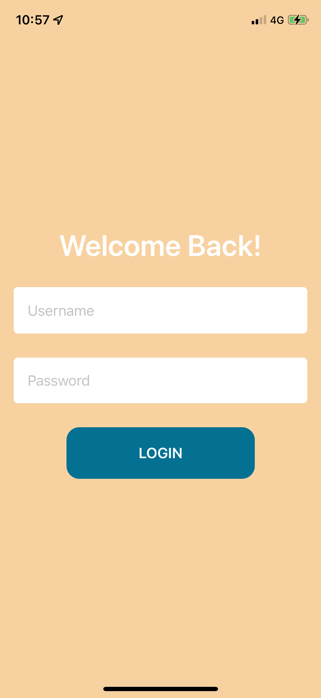

# FeedMe
An iPhone application to track diet calories for an athletes. This app has been fully written in Swift 5 with UIKit and SwiftUI. 

It is based on the previous [Diet Tracker](https://github.com/mathieudelehaye/Diet_Tracker_PHP) app. 

An [Android](https://github.com/mathieudelehaye/FeedMe) version of the app is in development.

  
  

  
  

  
  

  
  

  

