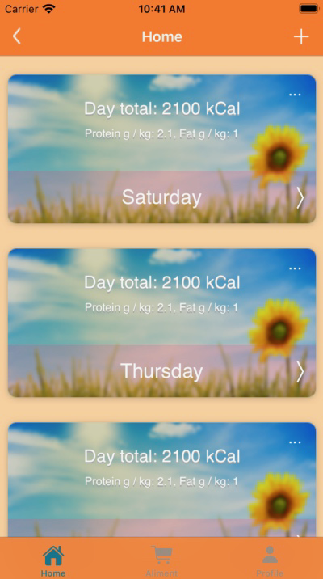
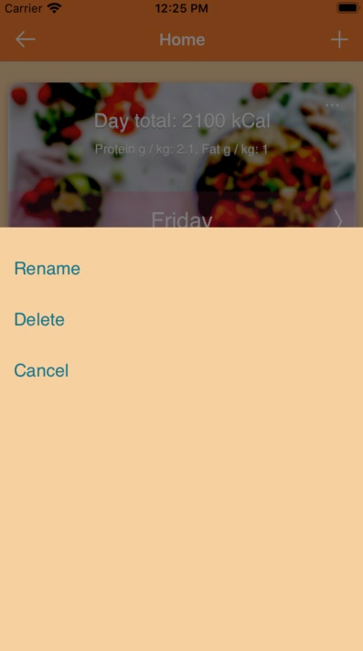
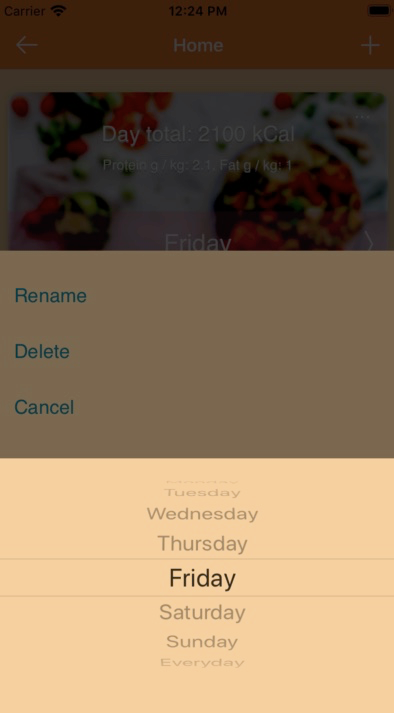
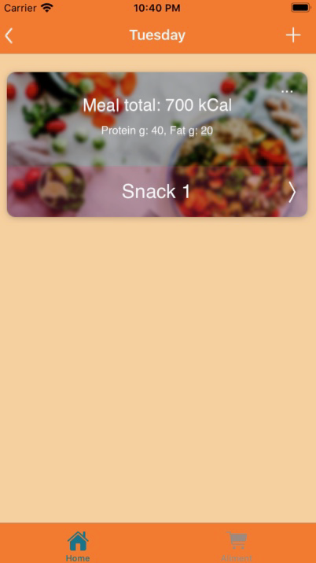
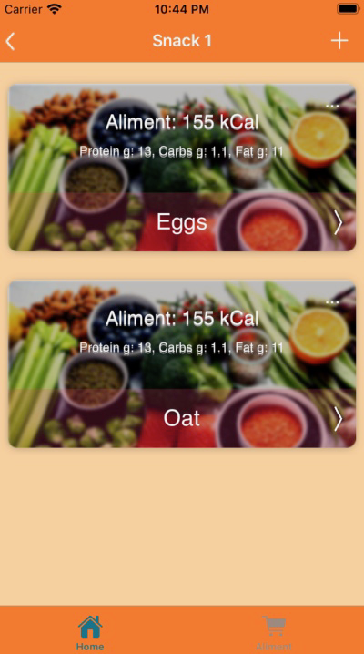
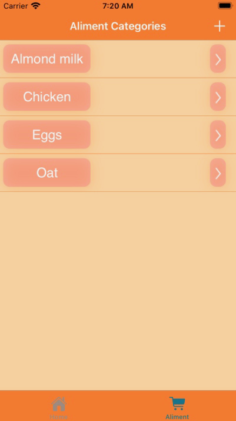
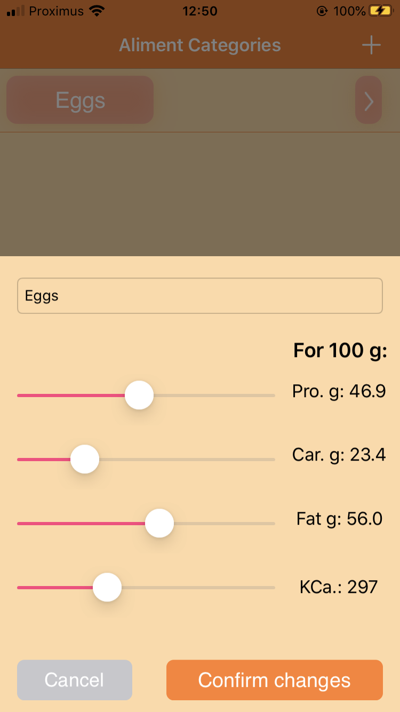
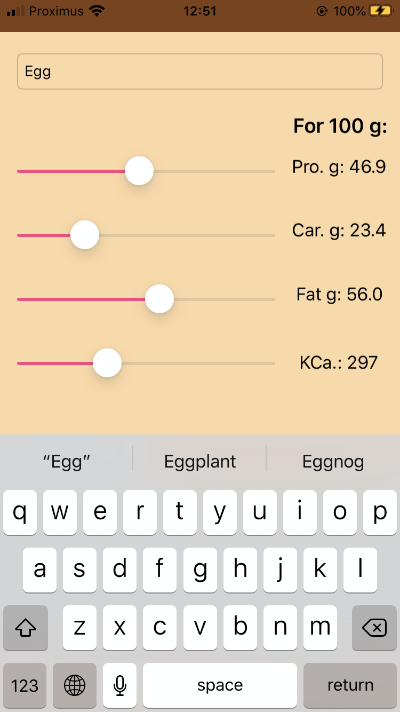

# FeedMe
An iPhone application to track diet calories for an athletes. 

It is based on the previous diet tracker app ([Diet Tracker](https://github.com/mathieudelehaye/Diet_Tracker_PHP)), fully rewritten in Swift 5 with UIKit and SwiftUI.  

  
  

  
  

  
  

  
  

